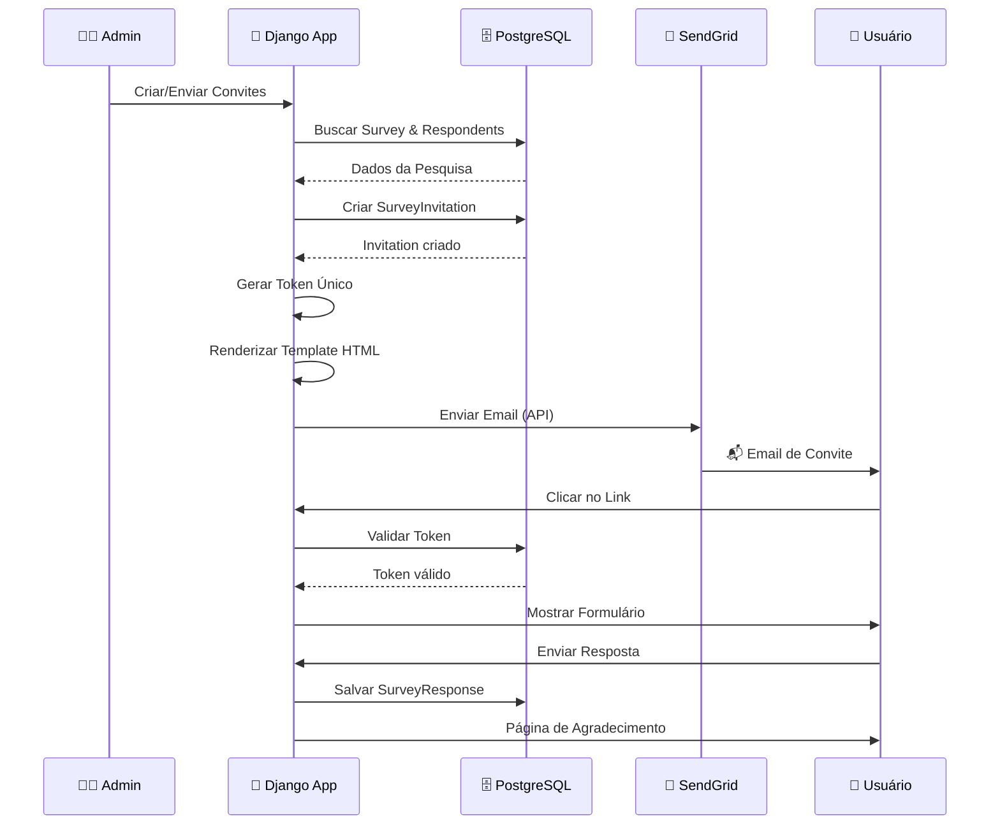
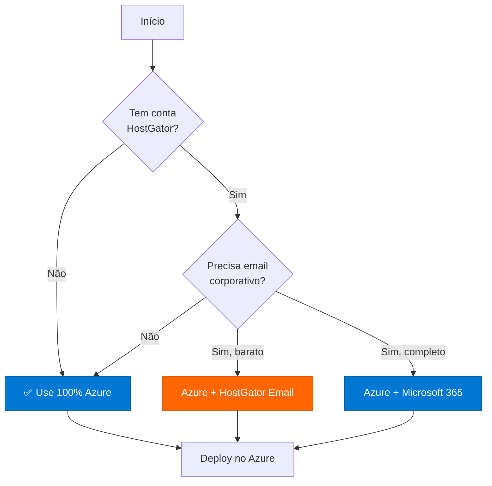

# 🏗️ Diagrama de Arquitetura - Sistema NPS Surveys no Azure

## Diagrama 1: Arquitetura Completa no Azure (Recomendada)

```mermaid
graph TB
    subgraph "Internet"
        Users[👥 Usuários/Convidados]
    end
    
    subgraph "Azure Cloud"
        subgraph "Networking"
            DNS[🌐 Azure DNS<br/>seudominio.com<br/>Registros A, CNAME, MX]
            CDN[📦 Azure CDN<br/>Arquivos Estáticos]
        end
        
        subgraph "Application Layer"
            Django[🐍 Azure App Service<br/>Django Backend<br/>- Web App<br/>- Admin Panel<br/>- API REST]
            FastAPI[⚡ Azure App Service<br/>FastAPI Service<br/>- REST API<br/>- Analytics]
        end
        
        subgraph "Data Layer"
            DB[(🗄️ Azure Database<br/>for PostgreSQL<br/>- Surveys<br/>- Responses<br/>- Invitations]
            Storage[💾 Azure Storage<br/>- Static Files<br/>- Logs<br/>- Backups]
        end
        
        subgraph "Communication"
            EmailService[📧 Azure Communication<br/>Services Email<br/>ou SendGrid<br/>- Envio de Convites<br/>- Tracking]
        end
        
        subgraph "Security & Monitoring"
            KeyVault[🔐 Azure Key Vault<br/>Secrets & Credentials]
            Monitor[📊 Application Insights<br/>Monitoring & Logs]
        end
    end
    
    subgraph "External Services"
        Office365[📬 Microsoft 365<br/>Email Corporativo<br/>Opcional]
    end
    
    Users -->|HTTPS| DNS
    DNS -->|Route| Django
    DNS -->|Route| FastAPI
    Django -->|Query| DB
    FastAPI -->|Query| DB
    Django -->|Send| EmailService
    Django -->|Store| Storage
    Django -->|Read Secrets| KeyVault
    Django -->|Logs| Monitor
    FastAPI -->|Logs| Monitor
    CDN -->|Serve| Storage
    EmailService -->|Deliver| Users
    EmailService -.->|Optional| Office365
    
    style Django fill:#0078d4,stroke:#005a9e,color:#fff
    style FastAPI fill:#0078d4,stroke:#005a9e,color:#fff
    style DB fill:#0078d4,stroke:#005a9e,color:#fff
    style EmailService fill:#0078d4,stroke:#005a9e,color:#fff
    style DNS fill:#0078d4,stroke:#005a9e,color:#fff
```

---

## Diagrama 2: Arquitetura Híbrida (Azure + HostGator)

```mermaid
graph TB
    subgraph "Internet"
        Users[👥 Usuários/Convidados]
    end
    
    subgraph "Azure Cloud"
        Django[🐍 Azure App Service<br/>Django Backend]
        FastAPI[⚡ Azure App Service<br/>FastAPI]
        DB[(🗄️ Azure Database<br/>PostgreSQL]
        SendGrid[📧 SendGrid<br/>Email Transacional]
        AzureDNS[🌐 Azure DNS<br/>App Domain]
    end
    
    subgraph "HostGator"
        HostDNS[🌐 HostGator DNS<br/>Email Domain]
        EmailMX[📬 Email MX Records<br/>Caixas Corporativas]
    end
    
    Users -->|HTTPS| AzureDNS
    AzureDNS --> Django
    AzureDNS --> FastAPI
    Django --> DB
    FastAPI --> DB
    Django --> SendGrid
    SendGrid -->|Deliver| Users
    
    EmailMX -.->|Recebe| Users
    HostDNS -.->|MX Records| EmailMX
    
    style Django fill:#0078d4,stroke:#005a9e,color:#fff
    style FastAPI fill:#0078d4,stroke:#005a9e,color:#fff
    style DB fill:#0078d4,stroke:#005a9e,color:#fff
    style SendGrid fill:#1a82e2,stroke:#005a9e,color:#fff
    style HostDNS fill:#ff6600,stroke:#cc5500,color:#fff
    style EmailMX fill:#ff6600,stroke:#cc5500,color:#fff
```

---

## Diagrama 3: Fluxo de Envio de Convites (Detalhado)



---

## Diagrama 4: Arquitetura de Segurança

```mermaid
graph TB
    subgraph "Internet"
        Users[👥 Usuários]
        Bots[🤖 Bots/Maliciosos]
    end
    
    subgraph "Azure Security Layer"
        WAF[🛡️ Azure WAF<br/>Web Application Firewall]
        DDoS[🛡️ DDoS Protection]
        Firewall[🔥 Azure Firewall]
    end
    
    subgraph "Application"
        AppService[🐍 App Service<br/>Django/FastAPI]
        KeyVault[🔐 Key Vault<br/>Secrets]
    end
    
    subgraph "Data"
        DB[(🗄️ Database<br/>PostgreSQL]
        Storage[💾 Storage<br/>Encrypted]
    end
    
    Users -->|HTTPS| WAF
    Bots -->|Blocked| WAF
    WAF --> DDoS
    DDoS --> Firewall
    Firewall --> AppService
    AppService -->|Get Secrets| KeyVault
    AppService -->|Encrypted| DB
    AppService -->|Encrypted| Storage
    
    style WAF fill:#ff0000,stroke:#cc0000,color:#fff
    style DDoS fill:#ff0000,stroke:#cc0000,color:#fff
    style Firewall fill:#ff0000,stroke:#cc0000,color:#fff
    style KeyVault fill:#ff6600,stroke:#cc5500,color:#fff
```

---

## Diagrama 5: Fluxo de Dados Completo

```mermaid
graph LR
    subgraph "Input"
        Admin[👨‍💼 Admin Panel]
        API[📡 REST API]
    end
    
    subgraph "Processing"
        Django[🐍 Django<br/>Business Logic]
        FastAPI[⚡ FastAPI<br/>Analytics]
    end
    
    subgraph "Storage"
        DB[(🗄️ PostgreSQL<br/>Structured Data]
        Storage[💾 Blob Storage<br/>Files & Logs]
        Cache[⚡ Redis Cache<br/>Sessions]
    end
    
    subgraph "Output"
        Email[📧 Email Service]
        Dashboard[📊 Dashboard]
        Reports[📄 Reports]
    end
    
    Admin --> Django
    API --> FastAPI
    Django --> DB
    Django --> Storage
    Django --> Cache
    FastAPI --> DB
    Django --> Email
    Django --> Dashboard
    FastAPI --> Reports
    
    style Django fill:#0078d4,stroke:#005a9e,color:#fff
    style FastAPI fill:#0078d4,stroke:#005a9e,color:#fff
    style DB fill:#336791,stroke:#1e4d6b,color:#fff
```

---

## Diagrama 6: Comparação de Arquiteturas

```mermaid
graph TB
    subgraph "Opção 1: 100% Azure"
        A1[Azure App Service]
        A2[Azure Database]
        A3[Azure Email Service]
        A4[Azure DNS]
        A1 --> A2
        A1 --> A3
        A4 --> A1
    end
    
    subgraph "Opção 2: Azure + HostGator"
        B1[Azure App Service]
        B2[Azure Database]
        B3[SendGrid]
        B4[HostGator DNS/Email]
        B1 --> B2
        B1 --> B3
        B4 -.-> B1
    end
    
    subgraph "Opção 3: Azure + Supabase"
        C1[Azure App Service]
        C2[Supabase DB]
        C3[SendGrid]
        C4[Azure DNS]
        C1 --> C2
        C1 --> C3
        C4 --> C1
    end
    
    style A1 fill:#0078d4,stroke:#005a9e,color:#fff
    style A2 fill:#0078d4,stroke:#005a9e,color:#fff
    style A3 fill:#0078d4,stroke:#005a9e,color:#fff
    style A4 fill:#0078d4,stroke:#005a9e,color:#fff
    style B1 fill:#0078d4,stroke:#005a9e,color:#fff
    style B2 fill:#0078d4,stroke:#005a9e,color:#fff
    style B3 fill:#1a82e2,stroke:#005a9e,color:#fff
    style B4 fill:#ff6600,stroke:#cc5500,color:#fff
    style C1 fill:#0078d4,stroke:#005a9e,color:#fff
    style C2 fill:#3ecf8e,stroke:#2eb875,color:#fff
    style C3 fill:#1a82e2,stroke:#005a9e,color:#fff
    style C4 fill:#0078d4,stroke:#005a9e,color:#fff
```



---

## 📊 Tabela Comparativa de Componentes

| Componente | Azure Nativo | SendGrid | HostGator | Supabase |
|------------|--------------|----------|-----------|----------|
| **Backend** | ✅ App Service | ❌ | ❌ | ❌ |
| **Database** | ✅ PostgreSQL | ❌ | ⚠️ MySQL | ✅ PostgreSQL |
| **Email Send** | ✅ Communication | ✅ SendGrid | ⚠️ SMTP | ❌ |
| **DNS** | ✅ Azure DNS | ❌ | ✅ Sim | ❌ |
| **Email Receive** | ✅ Microsoft 365 | ❌ | ✅ Sim | ❌ |
| **Custo/mês** | ~$43-48 | ~$0-15 | ~$3-5 | Gratuito* |

*Supabase tem limites no plano gratuito

---

## 🎯 Recomendação Final Visual



---

**Conclusão Visual:** A arquitetura 100% Azure é a mais recomendada para este projeto! 🚀

